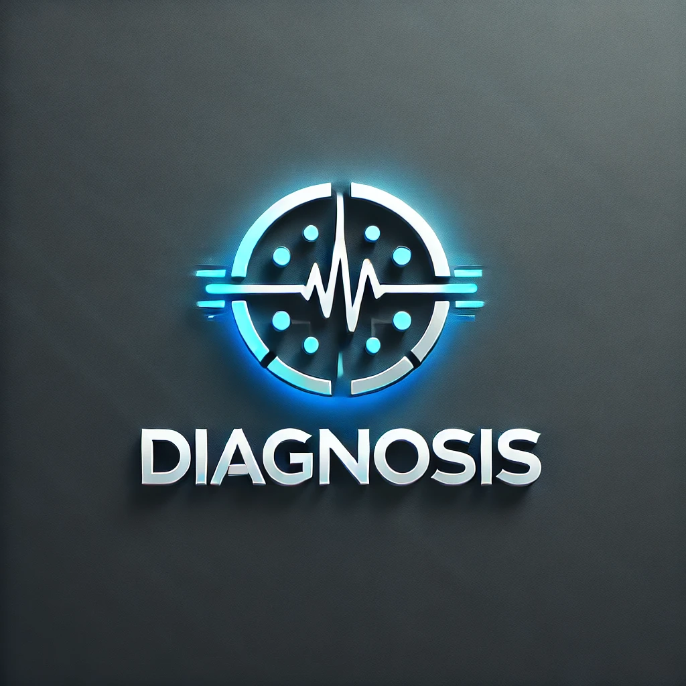

<p align="center">
  
</p>

## 👥 Participantes

- **Darío Nievas López 50%**  
- **Oscar Bermúdez Gallego 30%**  
- **José Antonio García Antona 20%**  

## 🏥 Asistente Médico IA con ChatGPT

Este es un asistente médico basado en **IA** que permite a los usuarios ingresar síntomas y obtener un diagnóstico estimado, junto con tratamientos recomendados. Utiliza un **modelo de aprendizaje profundo** para la predicción de enfermedades y una integración con **ChatGPT** para ofrecer explicaciones detalladas.

### 🚀 Características

- **Predicción de enfermedades** a partir de síntomas ingresados por el usuario.
- **Corrección de síntomas** mediante sugerencias inteligentes.
- **Tratamientos recomendados** en base a la enfermedad detectada.
- **Explicación médica con IA** gracias a OpenAI ChatGPT.
- **Interfaz interactiva** desarrollada con Streamlit.

## 🛠️ Instalación y Uso

### 1️⃣ Requisitos previos

- Python 3.8 o superior
- Tener una clave de API de OpenAI (ChatGPT)
- Tener instaladas las dependencias requeridas.

### 2️⃣ Instalación

Clona el repositorio y entra en el directorio del proyecto:

```bash
git clone https://github.com/tu_usuario/asistente_medico_ia.git
cd asistente_medico_ia
```

Instala las dependencias:

```bash
pip install -r requirements.txt
```

### 3️⃣ Configurar la API de OpenAI

Edita el archivo **`streamlit_app.py`** y agrega tu clave de API en la variable `OPENAI_API_KEY`, o crea un fichero .env donde almacenar tu API:

```python
OPENAI_API_KEY = os.getenv("OPENAI_API_KEY")
openai.api_key = OPENAI_API_KEY
```

### 4️⃣ Ejecutar la aplicación

Para iniciar la aplicación en **Streamlit**, ejecuta:

```bash
streamlit run streamlit_app.py
```

Esto abrirá la interfaz en tu navegador.

---

## 🎯 Funcionamiento

1️⃣ **Ingresar síntomas**  
   - Escribe los síntomas separados por comas.  
   - El sistema corregirá errores de escritura o sugerirá términos más adecuados.


2️⃣ **Predicción de enfermedades**  
   - El modelo de IA analizará los síntomas y mostrará las enfermedades más probables con sus porcentajes de confianza.


3️⃣ **Explicación con ChatGPT**  
   - Un chatbot médico explicará los tratamientos y detalles adicionales sobre la enfermedad.


     
4️⃣ **Recomendaciones de tratamiento**  
   - Se mostrarán los tratamientos más comunes para cada enfermedad detectada.


5️⃣ **Conclusión**  
   - Se mostrara una conclusión sobre la enfermedad y sus tratamientos.


---

## 💪 Tecnologías Utilizadas

- **Python** 🐍
- **TensorFlow/Keras** 🔥 (Red Neuronal para predicción)
- **Joblib** (Carga de modelos)
- **Pandas y NumPy** (Manejo de datos)
- **Streamlit** 🎨 (Interfaz de usuario interactiva)
- **OpenAI GPT-4o-mini** 🤖 (Chatbot médico)

---

## 📌 Notas Importantes

- **No sustituye a una consulta médica**: Este asistente es solo una herramienta de referencia.
- **Se recomienda validar los resultados con un profesional de la salud**.

## Enlace al video explicativo
[Ver video en YouTube](https://youtu.be/hqtpbRkKN68)

## Enlace al PDF
[Power Point formato PDF](https://drive.google.com/file/d/1kChjKob9bpxNyYWYSSvF1HAc_rqBreSQ/view?usp=drive_link)

